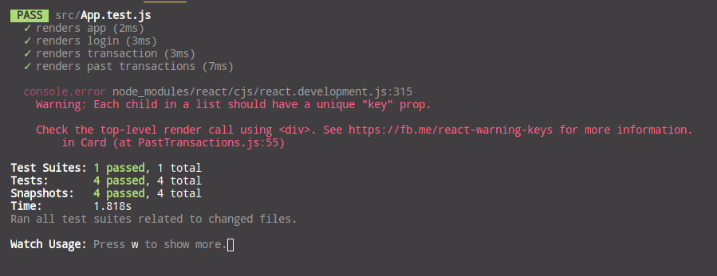

# Citi Ez-Transfer by Team TrizzaPizza

Team TrizzaPizza's submission for the Citi Virtual Hackathon 2020.

## Introduction

Ez-Transfer is a web centric solution for money transfer that focuses on security and seamless user experience.

## Security

Ez-transfer applies the following techniques to ensure secure transactions and user identity protection:

-   Json Web Tokens to handle user validation.

-   2FA sms services to handle authentication.

-   Database sanitisation to prevent injection attacks (Object Relational Mapping Layer).

-   CSRF protection.

## User Experience

Ez-transfer applies the following techniques on the User Experience side to provide the optimal experience for end users:

-   Optimistic confirmation to give users live feedback of their transfer progress.

-   Password free authentication to make it easier to log in.

## Demo

-   The frontend can be viewed at http://35.247.137.131:3000/

-   The backend docs can be viewed at http://35.247.137.131:8080/docs

-   Unit Tests

    

## Tech Stack

-   Frontend: React

-   Frontend Unit Tests: Jest and Enzyme

-   Backend: FastAPI (Python)

-   Database: PostgreSQL

-   Design Library: Ant Design

-   Deployment Tools: Docker-Compose

-   Cloud Deployment: GCP

-   2FA Service: Twilio

## Work Breakdown

### Chin Zhi Wei

-   Developed the python server, models and postgres database.

-   Deployed the backend service on GCP

### Nigel Lee

-   Setup Twilio account for 2FA authentication purposes.

-   Built the login page with 2FA capabilities.

-   Built the past transactions page

-   Setup the JWT handling

### Lester Tay

-   Built the transaction sending page

-   Setup the front end router

-   Setup the stylesheets
